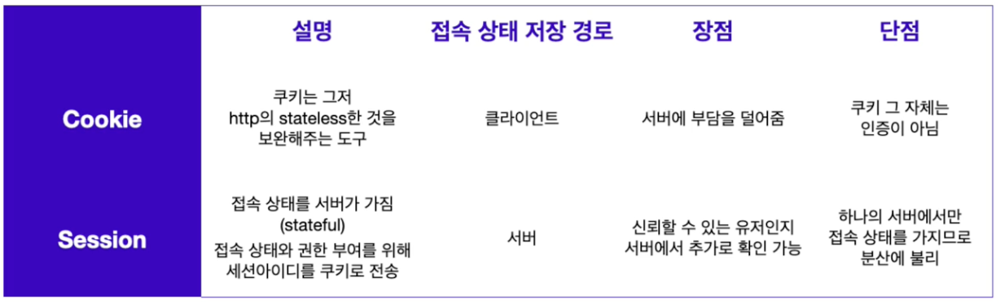

## Cookie
쿠키는 서버에서 클라이언트에 영속성 있는 데이터를 저장하는 방법이다. 서버에서 클라이언트의 쿠키를 이용해 데이터를 가져올 수 있고 클라이언트에서 서버로 쿠키를 다시 전송할 수 있다. 하지만 데이터를 저장한 이후 아무 때나 데이터를 가져올 수는 없다. 데이터를 저장한 이후 특정 조건들이 만족되어야 다시 가져올 수 있기 때문이다.
### 쿠키 옵션
- Domain
  - 도메인은 서버에 접속할 수 있는 이름이다. 쿠키 옵션에서 도메인은 포트, 서브 도메인 정보, 세부 경로를 포함하지 않는다. 요청할 URL이 `http://www.localhost.com:3000/users/login`인 경우 여기에서 도메인은 `localhost.com`이 된다.
  - 만약 쿠키 옵션에서 도메인 정보가 존재한다면 클라이언트에서는 쿠키의 도메인 옵션과 서버의 도메인이 일치해야만 쿠키를 전송할 수 있다.
- Path
  - Path는 세부 경로로써 서버가 라우팅할 때 사용하는 경로이다. 요청할 URL이 `http://www.localhost.com:3000/users/login`인 경우 여기에서 Path는 `/users/login`이 된다. 이를 명시하지 않으면 기본적으로 `/`으로 설정되어 있다.
  - Path옵션의 특징은 설정된 경로를 포함하는 하위 경로로 요청을 하더라도 쿠키를 서버에 전송할 수 있다. Path가 `/users`인 경우 요청하는 세부 경로가 `/users/login`인 경우라면 쿠키 전송이 가능하다.
- MaxAge, Expires
  - 쿠키가 유효한 기간을 정하는 옵션이다. MaxAge는 쿠키가 유효한 시간을 초 단위로 설정하고 Expires는 유효한 날짜를 지정할 수 있다. 옵션의 값은 클라이언트의 시간을 기준으로 하고 지정된 시간,날짜를 초과하게 되면 쿠키는 자동으로 소멸된다.
  - 쿠키는 이 옵션의 여부에 따라 세션 쿠키(Session Cookie)와 영속성 쿠키(Persistent Cookie)로 나뉜다.
  - 세션 쿠키 : 이 옵션이 없는 쿠키다. 브라우저가 실행 중일 때 사용할 수 있는 임시 쿠키이고 브라우저를 종료하면 해당 쿠키는 삭제된다.
  - 영속성 쿠키 : 브라우저의 종료 여부와 상관없이 이 옵션에 지정된 유효시간만큼 사용가능한 쿠키이다.
- Secure
  - 사용하는 프로토콜에 따른 쿠키의 전송 여부를 결정하는 옵션이다. 만약 이 옵션이 true로 설정된 경우 HTTPS를 이용하는 경우에만 쿠키를 전송할 수 있다. 단 도메인이 `localhost`인 경우에는 HTTPS가 아니어도 쿠키 전송이 가능하다.
- HttpOnly
  - 자바스크립트로 브라우저의 쿠키에 접근이 가능한지 여부를 결정한다. 만약 이 옵션이 true로 설정된 경우 자바스크립트로 쿠키에 접근이 불가하다. 옵션을 명시하지 않은 경우에는 기본적으로 false로 지정된다. 만약 false일 경우 `document.cookie`를 이용해 자바스크립트로 쿠키에 접근할 수 있으므로 탈취될 위험이 있다.
- SameSite
  - Cross-Site 요청을 받은 경우 요청에서 사용한 메서드와 해당 옵션의 조합을 기준으로 서버의 쿠키 전송 여부를 결정하게 된다. Cross-Origin과 Cross-Site를 혼동하지 않도록 주의해야 한다.
    - Cross-Origin : 서버의 도메인, 프로토콜, 포트 중 하나라도 다른 경우
      - `http://google.com` vs `https://google.com` = 프로토콜이 다르므로 Cross-Origin이다.
      - `https://google.com:443` vs `https://google.com` = https의 기본 포트는 443이다. 따라서 도메인, 프로토콜, 포트가 모두 같은 Same-Origin이다.
    - Cross-Site : eTLD+1 이 다른 경우
      - eTLD+1 : eTLD 바로 왼쪽의 하위 레벨 도메인을 합한 것
        - TLD(Top Level Domain, 최상위 도메인) : .com, .org, .kr, .io 같이 도메인의 가장 마지막 부분
        - eTLD(Effective Top Level Domain, 유효 최상위 도메인) : 사이트를 식별할 수 있을 만큼 세분화된 TLD이다. .com, .org와 같은 TLD는 그 자체로도 eTLD로 판단하며 .kr, .io 같은 TLD는 하위 도메인을 하나 더 한 .co.kr, .github.io 등을 eTLD라고 판단한다.
      - `http://google.com` vs `https://google.com` = 두 주소 모두 eTLD는 .com, eTLD+1은 google.com 이므로 Same-Site 이다.
      - `https://code.github.io` vs `https://main.github.io` = 두 주소 모두 eTLD가 github.io로 같지만 eTLD+1은 각각 code.github.io, main.github.io로 다르므로 Cross-Site 이다.
  - SameSite 옵션
    - Lax : Cross-Site 요청이라면 GET메서드에 대해서만 쿠키를 전송할 수 있다.
    - Strict : Cross-Site가 아닌 Same-Site인 경우에만 쿠키를 전송할 수 있다.
    - None : 항상 쿠키를 보내줄 수 있지만 쿠키 옵션 중 Secure 옵션이 필요하다.
- 서버에서 이런 옵션들을 지정한 다음 클라이언트로 쿠키를 처음 전송하게 된다면 헤더에 `Set-Cookie`라는 프로퍼티로 쿠키를 담아 전송한다. 이후 클라이언트에서 서버에게 쿠키를 전송해야 한다면 헤더에 `Cookie`라는 프로퍼티에 쿠키를 담아 전송한다.

### 쿠키를 이용한 상태 유지
- 이러한 쿠키의 특성을 이용해 서버는 클라이언트에 인증정보를 담은 쿠키를 전송하고 클라이언트는 전달받은 쿠키를 서버에 요청과 함께 전송해 Stateless한 인터넷 연결을 Stateful하게 유지할 수 있다.
- 하지만 기본적으로 쿠키는 오랜 시간 동안 유지될 수 있고 HttpOnly옵션을 사용하지 않았다면 자바스크립트를 이용해서 쿠키에 접근할 수 있기 때문에 쿠키에 민감한 정보를 담는 것은 위험하다.

> [MDN - Set-Cookie Attributes](https://developer.mozilla.org/en-US/docs/Web/HTTP/Headers/Set-Cookie)


## Session
쿠키와 달리 중요한 데이터는 서버에서 관리하고 서버가 클라이언트(쿠키)에 유일하고 암호화된 ID를 부여한다. 서버로 인증 과정을 한번 더 거치기 때문에 쿠키보다는 안전하지만 대규모 서비스일 경우 서버 메모리에 부담을 줘서 서버 성능 저하를 일으킬 수 있고 쿠키의 단점인 XSS공격에 취약한 점도 그대로 존재한다.
### 세션 기반 인증
- 로그인
  - 사용자가 웹사이트에서 로그인을 시도할 때 정확한 아이디,비밀번호를 입력했다면 서버는 인증에 성공했다고 판단한다.
  - 이때 서버는 사용자가 인증에 성공했음을 알고 있어야 하고 클라이언트는 인증 성공을 증명할 수단을 갖고 있어야 한다.
  - 사용자가 인증에 성공한 상태는 세션이라고 부른다. 서버는 일종의 저장소에 세션을 저장한다. 주로 in-memory 또는 세션 스토어에 저장한다.
  - 세션이 만들어지면 각 세션을 구분할 수 있는 세션 아이디도 만들어지는데 클라이언트에 세션 성공을 증명할 수단으로써 세션 아이디를 전달한다.
  - 이때 웹사이트에서 로그인을 유지하기 위한 수단으로 쿠키를 사용한다. 쿠키에는 서버에서 발급한 세션 아이디를 저장한다.
- 로그아웃
  - 서버에서는 세션 정보를 삭제해야 하고 클라이언트에서는 쿠키를 변경하거나 삭제해야 한다.
  - 클라이언트에서 세션 정보를 없애기 위해서는 `res.cookie`로 쿠키의 값을 무효한 값으로 변경하거나 `res.clearCookie`로 쿠키를 삭제해 버리면 된다.

### express-session
Node.js에는 세션을 대신 관리해 주는 `express-session`이라는 모듈이 있다. 세션을 위한 미들웨어로 express 서버에서 쉽게 세션을 위한 공간을 다룰 수 있도록 만들어준다.
```js
const express = require('express');
const session = require('express-session');

const app = express();

app.use(
  session({
    secret: '@codestates',
    resave: false,
    saveUninitialized: true,
    cookie: {
      domain: 'localhost',
      path: '/',
      maxAge: 24 * 6 * 60 * 10000,
      sameSite: 'none',
      httpOnly: false,
      secure: true,
    },
  })
);
```
- 쿠키 옵션과 비슷해 보이지만 세션의 경우 `secret`옵션의 비밀키를 이용해 암호화해 세션 아이디를 생성한다. 그리고 이것을 클라이언트에게 쿠키로 전송한다. 
- 쿠키로 전송된 세션 아이디는 이에 종속되는 고유한 세션 객체를 가지며 서버에 저장된다. 세션 객체는 유저별로 독립적으로 생성된 객체이므로 각각 다른 데이터를 저장할 수 있다.
- 따라서 클라이언트에 유저의 개인정보를 담지 않고도 서버가 클라이언트의 세션 아이디를 이용해 유저의 인증여부를 판단할 수 있다.
- 세션 객체는 `req.session`으로 접근할 수 있으며 이를 통해 세션에 임의의 데이터를 저장하거나 불러올 수 있다.

> [GitHub: express-session](https://github.com/expressjs/session#reqsession)