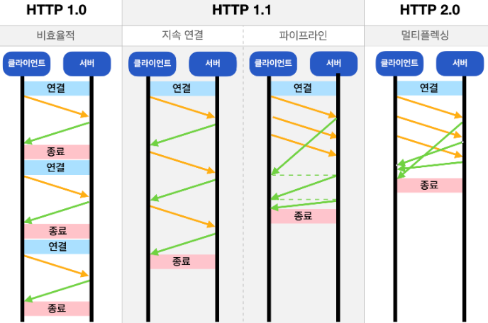
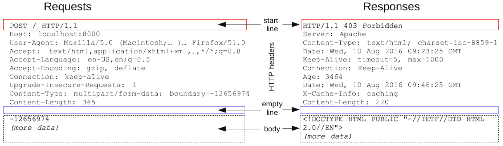
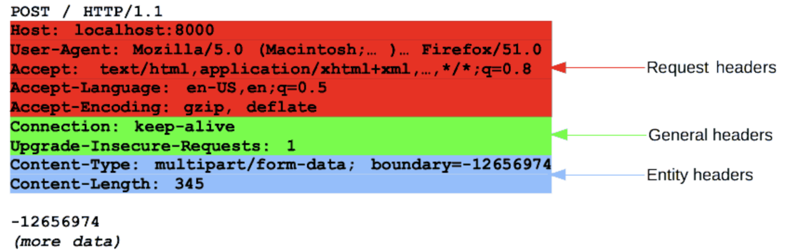
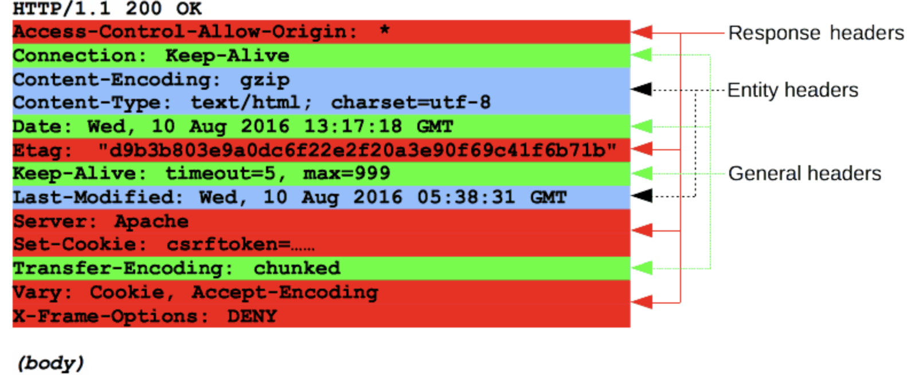
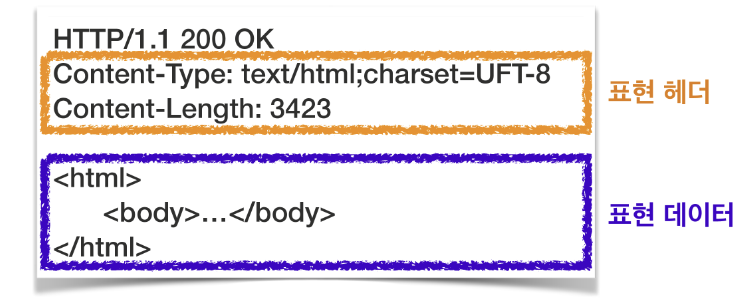
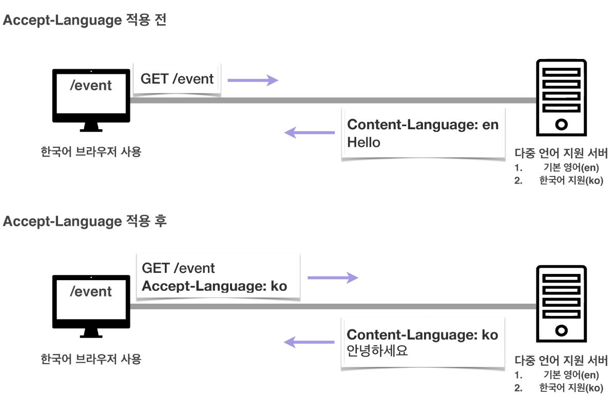

## HTTP
HTTP(HyperText Transfer Protocol)는 HTML과 같은 문서를 전송하기 위한 프로토콜. 웹 브라우저와 웹 서버의 소통을 위해 디자인되었다. HTTP/1.1, HTTP/2는 TCP기반이며 HTTP/3는 UDP기반이다.

### 특징
- 클라이언트 서버 구조
  - Request, Response 구조. 클라이언트가 HTTP Messages 양식에 맞춰 요청을 보내고 응답을 대기하면  서버가 HTTP Messages 양식에 맞춰 응답한다. 
- 무상태성(Stateless)
  - 서버가 클라이언트의 상태를 보존하지 않음
  - 장점 : 서버 확장성 높음
  - 단점 : 클라이언트가 추가 데이터 전송
- 비연결성(Connectionless)
- HTTP 메세지

### 무상태성(Stateless) vs 상태 유지(Stateful)
- 상태 유지
  - 클라이언트의 요청을 하나의 서버가 기억하고 있기 때문에 항상 같은 서버가 응답 해야한다. 
  - 만약 요청을 받은 서버가 장애가 발생하면 유지되던 상태 정보가 사라지므로 처음부터 다시 서버에 요청 해야한다.
  - e.g. 로그인
  - 로그인한 사용자의 경우 로그인했다는 상태를 서버에 유지(브라우저 쿠키, 서버 세션). 상태 유지는 최소한만 사용
- 무상태성
  - 클라이언트가 요청할때 이미 필요한 데이터를 다 담아서 보내기 때문에 아무 서버나 호출해도 된다. 
  - 만약 요청을 받은 서버가 장애가 발생해도 다른 서버에서 응답을 전달하면 되기 때문에 클라이언트는 다시 요청할 필요가 없다. 
  - 이런 특징으로 응답 서버를 쉽게 바꿀 수 있어서 무한 서버 증설이 가능하다.
  - 모든 것을 무상태로 설계할 수 있는 경우도 있고 없는 경우도 있다.
  - e.g. 로그인이 필요없는 단순한 서비스 소개 화면

### 비연결성(Connectionless) vs 연결 유지(Connection Oriented)
- 연결 유지
  - TCP/IP의 경우 기본적으로 연결을 유지한다. 서버에 요청을 보내지 않는 클라이언트들도 계속 연결을 유지해야 하므로 서버의 자원이 계속 소모된다.
- 비연결성
  - HTTP에서는 실제로 요청을 주고받을 때만 연결을 유지하고 응답을 주고 나면 TCP/IP 연결을 끊는다. 이를 통해 최소한의 자원으로 서버 유지를 가능하게 한다.
  - 트래픽이 많지 않고 빠른 응답을 제공할 수 있는 경우 비연결성의 특징은 효율적으로 작동한다.
  - 트래픽이 많고 큰 규모의 서비스를 운영할 때에는 한계가 있다.
    - TCP/IP 연결을 새로 맺어야 한다. 3 way handshake 시간 추가
    - 웹 사이트를 요청하면 html,js,css,이미지 등 수 많은 자원이 함께 다운로드
    - 각각의 자원을 다운로드 하기 위해 연결과 종료를 반복
    - 지금은 HTTP 지속 연결로 문제 해결
      - 연결이 이뤄지고 난 뒤 각각의 자원들을 요청하고 모든 자원에 대한 응답이 돌아온 후에 연결을 종료

### HTTP Messages
클라이언트와 서버 사이에서 데이터가 교환되는 방식이며 몇 줄의 텍스트 정보로 구성된다.
- start line : start line에는 요청이나 응답의 상태를 나타낸다. 응답에서는 status line이라고 부른다.
- HTTP headers : 요청을 지정하거나 메시지에 포함된 본문을 설명하는 헤더의 집합
- empty line : 헤더와 본문을 구분하는 빈 줄
- body : 요청이나 응답과 관련된 데이터 또는 문서를 포함. 요청과 응답의 유형에 따라 선택적으로 사용
- start line과 HTTP headers를 묶어 요청,응답의 head라고 하고 payload는 body라고 한다.

#### Requests
- Start line
  - 수행할 작업(GET,POST 등)이나 방식(HEAD, OPTIONS)을 설명하는 HTTP method를 나타낸다.
  - 요청 대상(URL,URI 등), 프로토콜, 포트, 도메인의 절대 경로는 요청 컨텍스트에 작성된다. 이 요청은 HTTP method마다 다르다
    - origin 형식 : `'?'`와 쿼리 문자열이 붙는 절대 경로. GET,POST,OPTIONS 등의 method와 함께 사용
      - `POST / HTTP 1.1` , `GET /background.png HTTP/1.0`, ...
    - absolute 형식 : 완전한 URL형식으로 프록시에 연결하는 경우 대부분 GET과 사용한다.
      - `GET http://developer.mozilla.org/en-US/docs/Web/HTTP/Messages HTTP/1.1`
    - authority 형식 : 도메인 이름과 포트 번호로 이루어진 URL의 일부분. HTTP 터널을 구축하는 경우 CONNECT와 함께 사용할 수 있다.
      - `CONNECT developer.mozilla.org:80 HTTP/1.1`
    - asterisk 형식 : OPTIONS와 함께 `*` 하나로 서버 전체를 표현
      - `OPTIONS * HTTP/1.1`
    - HTTP 버전에 따라 메시지 구조가 달라지며 start line에 HTTP버전을 함께 입력한다
- Headers
  - 
  - 요청의 Headers는 기본 구조를 따른다. 헤더 이름(대소문자 구분 없는 문자열),콜론(:), 값을 입력한다.
  - General headers : 메시지 전체에 적용되는 헤더. body를 통해 전송되는 데이터와는 관련 없음
  - Request headers : fetch를 통해 가져올 리소스나 클라이언트 자체에 대한 자세한 정보를 포함하는 헤더. User-Agent, Accept-Type, Accept-Language와 같은 헤더는 요청을 보다 구체화한다. Referer처럼 컨텍스트를 제공하거나 If-None과 같이 조건에 따라 제약을 추가할 수 있다.
  - Representation headers : 이전에는 Entity headers로 불렸으며 body에 담긴 리소스의 정보(콘텐츠의 길이, MIME 타입 등)을 포함하는 헤더
- Body
  - GET, HEAD, DELETE, OPTIONS 처럼 서버에 리소스를 요청하는 경우에는 본문이 필요하지 않다. POST나 PUT과 같은 일부 요청은 데이터를 업데이트하기 위해 사용한다.
  - Single-resource bodies(단일-리소스 본문) : 헤더 두개(Content-Type, Content-Length)로 정의된 단일 파일로 구성
  - Multiple-resource bodies(다중-리소스 본문) : 여러 파트로 구성된 본문에서는 각 파트마다 다른 정보를 지닌다. 보통 HTML form과 관련이 있다.

#### Responses
- Status line
  - 현재 프로토콜 버전(HTTP/1.1)
  - 상태 코드 - 요청의 결과를 나타낸다.(200,302,404 등)
  - 상태 텍스트 - 상태 코드에 대한 설명
  - `HTTP/1.1 404 Not Found`
- Headers
  - 
  - 요청 헤더와 동일한 구조를 가진다.
  - Response headers : 위치 또는 서버 자체에 대한 정보(이름,버전 등)와 같이 응답에 대한 부가적인 정보를 갖는 헤더. Vary, Accept-Ranges와 같이 상태 줄에 넣기에는 공간이 부족했던 추가 정보를 제공
- Body
  - 201, 204와 같은 상태 코드를 가지는 응답에는 본문이 필요하지 않다.
  - Single-resource bodies(단일-리소스 본문)
    - 길이가 알려진 단일-리소스 본문은 두개의 헤더(Content-Type, Content-Length)로 정의한다.
    - 길이를 모르는 단일 파일로 구성된 단일-리소스 본문은 Transfer-Encoding이 `chunked`로 설정되어 있으며 파일은 `chunk`로 나뉘어 인코딩 되어 있다.
  - Multiple-resource bodies(다중-리소스 본문) : 서로 다른 정보를 담고있는 body

 

### 표현 헤더(Representation Headers)
표현은 요청이나 응답에서 전달할 실제 데이터. 표현 헤더는 표현 데이터를 해석할 수 있는 정보 제공(데이터 유형,길이,압축 정보 등).

- Content-Type
  - 표현 데이터의 형식(미디어 타입, 문자 인코딩)
  - e.g. Text/html;charset=utf-8, application/json, Image/png ...
- Content-Encoding
  - 표현 데이터의 압축 방식
  - 데이터를 전달하는 곳에서 압축 후 인코딩 헤더 추가
  - 데이터를 읽는 쪽에서 인코딩 헤더의 정보로 압축 해제
  - e.g. gzip, deflate, identity ...
- Content-Language
  - 표현 데이터의 자연 언어
  - e.g. ko, en, en-US ...
- Content-Length
  - 표현 데이터의 길이(byte 단위)
  - Transfer-Encoding(전송 코딩)을 사용하면 Content-Length를 사용하면 안됨

#### 요청에서 사용되는 헤더
- Form : 유저 에이전트의 이메일 정보
  - 일반적으로 잘 사용하지 않음. 검색 엔진에서 주로 사용
- Referer : 이전 웹 페이지 주소
  - 현재 요청된 페이지의 이전 웹 페이지 주소
  - A->B로 이동하는 경우 B를 요청할 때 `Referer: A`를 포함해서 요청
  - `Referer`를 사용하면 유입경로 수집 가능
- User-Agent : 유저 에이전트 애플리케이션 정보
  - 클라이언트의 애플리케이션 정보(웹 브라우저 정보 등)
  - 어떤 종류의 브라우저에서 장애가 발생했는지 파악 가능
- Host : 요청한 호스트 정보(도메인)
  - 필수 헤더
  - 하나의 서버가 여러 도메인을 처리해야 할 때 호스트 정보를 명시하기 위해 사용
  - 하나의 IP 주소에 여러 도메인이 적용되어 있을 때 호스트 정보를 명시하기 위해 사용
- Origin : 서버로 POST요청을 보낼 때 요청을 시작한 주소 정보
  - 요청을 보낸 주소와 받는 주소가 다르면 CORS에러 발생
  - 응답 헤더의 Access-Control-Allow-Origin 관련
- Authorization : 인증 토큰을 서버로 보낼 때 사용하는 헤더
  - 토근의 종류 + 실제 토큰 문자
#### 응답에서 사용되는 헤더
- Server : 요청을 처리하는 ORIGIN서버의 소프트웨어 정보
- Date : 메시지가 발생한 날짜와 시간
- Location : 페이지 리디렉션
  - 웹 브라우저는 3xx응답의 결과에 Location헤더가 있으면 Location 위치로 리다이렉트
  - 201(Created) : Location값은 요청에 의해 생성된 리소스 URI
  - 3xx(Redirection) : Location값은 요청을 자동으로 리디렉션하기 위한 대상 리소스를 가리킴
- Allow : 허용 가능한 HTTP 메서드
  - 405(Method Not Allowed)에서 응답에 포함
- Retry-After : 유저 에이전트가 다음 요청을 하기까지 기다려야 하는 시간
  - 503(Service Unavailable) : 서비스가 언제까지 불능인지 알려줄 수 있음

[wikipedia - List of HTTP headers ](https://en.wikipedia.org/wiki/List_of_HTTP_header_fields)

 

### 콘텐츠 협상 헤더
콘텐츠 협상(Content negotiation)은 클라이언트가 선호하는 표현 요청. 협상 헤더는 요청시에만 사용한다.

- Accept : 클라이언트가 선호하는 미디어 타입 전달
- Accept-Charset : 클라이언트가 선호하는 문자 인코딩
- Accept-Encoding : 클라이언트가 선호하는 압축 인코딩
- Accept-Language : 클라이언트가 선호하는 자연 언어
- 우선순위
  - Quality Values(q) 값 사용
  - 0~1, 클수록 높은 우선순위
  - 생략하는 경우 1
  - `Accept-Language: ko-KR,ko;q=0.9,en-US;q=0.8;en;q=0.7`