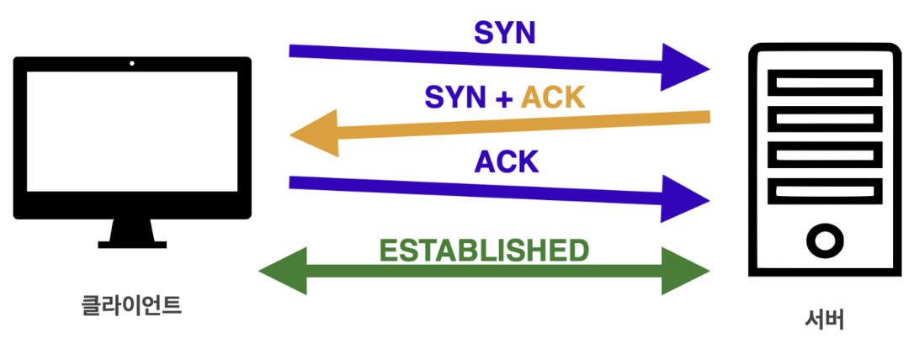

## IP(Internet Protocol)
- IP는 네트워크 상에서 클라이언트와 서버가 서로 소통하기 위한 통신 규약이다. IP는 지정한 IP 주소(IP Address)에 `패킷(Packet)`이라는 통신 단위로 데이터를 전달한다.
- IP 패킷에는 데이터를 전송하기 위해 출발지,목적지 IP주소 정보가 포함되어 있다. 
- 클라이언트에서 패킷 단위로 전송을 하면 노드(서버 컴퓨터)들은 목적지 IP에 도달하기 위해 서로 데이터를 전달한다.
- 서버에서 데이터를 전송받는다면 서버 역시 IP패킷을 이용해 클라이언트에 응답을 전달한다.
### IP의 한계
- 비연결성
  - 만약 패킷을 받을 대상이 없거나 서비스 불능 상태여도 클라이언트는 서버의 상태를 파악할 방법이 없기 때문에 패킷을 그대로 전송하게 된다.
- 비신뢰성
  - 중간에 있는 서버가 데이터를 전달하던 중 장애가 생겨 패킷이 중간에 소실되더라도 클라이언트는 이를 파악할 방법이 없다.
  - 전달 데이터의 용량이 클 경우 이를 패킷 단위로 나눠 데이터를 전달하게 되는데 이때 패킷들은 중간에 서로 다른 노드를 통해 전달될 수 있어서 클라이언트가 의도하지 않은 순서로 서버에 패킷이 도착할 수 있다.

 

## TCP(Transmission Control Protocol)
TCP는 IP 프로토콜보다 더 높은 계층에 TCP 프로토콜이 존재하기 때문에 IP 한계를 보완할 수 있다. 전송 계층에서 IP 패킷을 생성하기 전 TCP 세그먼트를 생성한다. TCP 세그먼트에는 IP패킷의 출발/목적지 IP 주소 정보를 보완할 수 있는 출발/목적지 PORT, 전송 제어, 순서, 검증 정보 등을 포함한다. TCP는 같은 계층에 속한 UDP에 비해 상대적으로 신뢰할 수 있는 프로토콜이다.

### 특징
- 3 way handshake (가상연결)
  - TCP는 장치들 사이에 논리적인 접속을 성립하기 위해 3 way handshake를 사용하는 연결지향형 프로토콜이다. 클라이언트는 서버에 접속을 요청하는 SYN(Synchronize) 패킷을 보낸다. 서버는 SYN요청을 받고 클라이언트에게 요청을 수락한다는 ACK(Acknowledgment)와 SYN가 설정된 패킷을 발송하고 클라이언트가 다시 ACK으로 응답하기를 기다린다. 클라이언트가 서버에게 ACK를 보내면 이 이후로부터 연결이 성립되며 데이터를 전송할 수 있다. 만약 서버가 꺼져있다면 클라이언트가 SYN을 보내고 서버에서 응답이 없기 때문에 데이터를 보내지 않는다. 현재는 최적화가 이루어져 3번 ACK을 보낼 때 데이터를 함께 보내기도 한다.
  - 
- 데이터 전달 보증
  - TCP는 데이터 전송이 성공적으로 이루어진다면 이에 대한 응답을 돌려주기 때문에 IP패킷의 한계인 비연결성을 보완할 수 있다.
- 순서 보장
  - 만약 패킷이 순서대로 도착하지 않는다면 TCP 세그먼트에 있는 정보를 토대로 다시 패킷 전송을 요청할 수 있다. 이를 통해 IP패킷의 한계인 비신뢰성을 보완할 수 있다.
  - 데이터가 유실되어서 들어온 경우 재전송 요청
    - Go-Back-N : 순서가 잘못 들어온 패킷부터 다시 재전송 요청
      - 데이터가 1~5 중에 1,2,4... 순서로 들어온다면 4이후로 들어온 패킷은 모두 폐기하고 3부터 다시 받는 방식
      - 재조립 과정이 필요없지만 불필요한 네트워크 요청을 추가로 보내야한다.
    - Selective Repeat : 빠진 패킷만 재전송 요청
      - 데이터가 1~5 중에 1,2,4... 순서로 들어온다면 빠진 패킷인 3만 재전송 요청을 한다.
      - 패킷을 재조합하기 위한 추가 공간이 필요하다.
  - 데이터가 유실되지 않았지만 순서가 맞지않게 들어온 경우 재조합한다.

 

## UDP(User Datagram Protocol)
UDP는 IP에 PORT, 체크섬 필드 정보만 추가된 단순한 프로토콜이다.
- 체크섬(checksum) : 중복 검사의 한 형태로 오류 정정을 통해 공간(전자 통신)이나 시간(기억 장치)속에서 송신된 자료의 무결성을 보호하는 단순한 방법
### 특징
- TCP에 비해 신뢰성은 낮지만 3 way handshake 방식을 사용하지 않기 때문에 비교적 빠른 속도를 보장한다.
  - 비연결 지향, 데이터 전달 보증 X, 순서 보장 X
- 이미 여러 기능이 구현된 TCP보다는 커스터마이징이 가능하다는 장점이 있다.
- 신뢰성보다는 연속성이 중요한 서비스(e.g. 실시간 스트리밍)에 자주 사용
