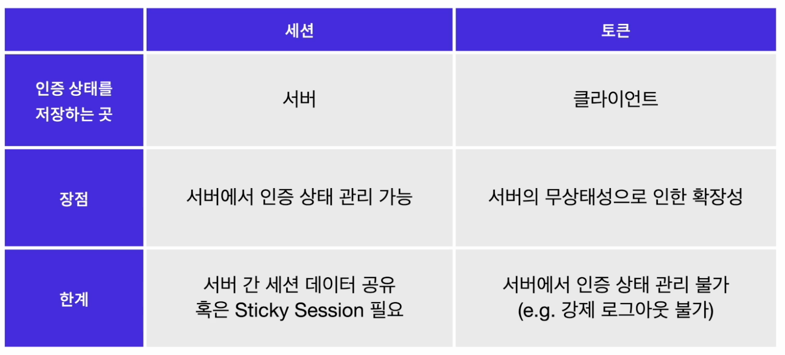

## 해싱(Hashing)
해싱은 가장 많이 쓰이는 암호화 방식 중 하나이다. 복호화가 가능한 다른 암호화 방식들과 달리 해싱은 암호화만 가능하다. 해시 함수(Hash Function)을 사용하여 암호화를 진행한다.
- 항상 같은 길이의 문자열을 리턴한다.
- 서로 다른 문자열에 동일한 해시 함수를 사용하면 반드시 다른 결과값이 나온다.
- 동일한 문자열에 동일한 해시 함수를 사용하면 항상 같은 결과값이 나온다.

해싱이 복호화가 불가능한 암호화 방식을 사용하는 이유는 데이터 그 자체를 사용하는 것이 아니라 동일한 값의 데이터를 사용하고 있는지 여부만 확인하는 것이 해싱의 목적이다. 해싱은 민감한 데이터를 다뤄야 하는 상황에서 데이터 유출의 위험성은 줄이면서 데이터의 유효성을 검증하기 위해서 사용되는 단방향 암호화 방식이다.

### 레인보우 테이블과 솔트(Salt)
- 항상 같은 결과값이 나온다는 특성을 이용해 해시 함수를 거치기 이전의 값을 알아낼 수 있도록 기록해 놓은 표인 레인보우 테이블이 존재한다. 레인보우 테이블에 기록된 값의 경우에는 유출이 되었을 때 해싱을 했더라도 해싱 이전의 값을 알아낼 수 있으므로 보안상 위협이 될 수 있다. 
- 이때 활용할 수 있는 것이 `솔트(Salt)`이다. 말 그대로 소금을 치듯 해싱 이전 값에 임의의 값을 더해 데이터가 유출되더라도 해싱 이전의 값을 알아내기 더욱 어렵게 만드는 방법이다. 
- 솔트를 사용하게 되면 해싱 값이 유출되더라도 솔트가 함께 유출된 것이 아니라면 암호화 이전의 값을 알아내는 것은 불가능에 가깝다.

<br/>

## 토큰(Token)

- 웹 보안에서의 토큰은 인증과 권한 정보를 담고 있는 암호화된 문자열을 말한다. 이를 이용해 특정 애플리케이션에 대한 사용자의 접근 권한을 부여할 수 있다. 
- 토큰 기반 인증은 기존의 세션 기반 인증이 가지고 있던 한계를 극복하고자 고안되었다. 세션 기반 인증은 서버에서 유저의 상태를 관리한다. 
- 토큰은 유저의 인증 상태를 클라이언트에 저장할 수 있어서 서버의 부하나 메모리 부족 문제를 줄일 수 있다.

### 토큰 기반 인증
- 사용자가 인증 정보를 담아 서버에 로그인 요청을 보낸다.
- 서버는 데이터베이스에 저장된 사용자의 인증 정보를 확인한다.
- 인증에 성공했다면 해당 사용자의 인증 및 권한 정보를 서버의 비밀 키와 함께 토큰으로 암호화한다.
- 생선된 토큰을 클라이언트로 전달한다.
  - HTTP상에서 인증 토큰을 보내기 위해 사용하는 헤더인 Authorization 헤더를 사용하거나 쿠키로 전달하는 등의 방법을 사용
- 클라이언트는 전달받은 토큰을 저장한다.
  - 저장하는 위치는 Local Storage, Session Storage, Cookie 등
- 클라이언트가 서버로 리소스를 요청할 때 토큰을 함께 전달한다.
  - 토큰을 보낼 때에도 Authorization 헤더를 사용하거나 쿠키로 전달
- 서버는 전달받은 토큰을 서버의 비밀 키를 통해 검증하고 토큰이 위조되었는지 혹은 토큰의 유효 기간이 지나지 않았는지 확인한다.
- 토큰이 유효하다면 클라이언트의 요청에 대한 응답 데이터를 전송한다.

### 토큰 인증 방식의 장점
- 무상태성 : 서버가 유저의 인증 상태를 관리하지 않는다. 서버는 비밀 키를 통해 클라이언트에서 보낸 토큰의 유효성만 검증하면 되기에 무상태적인 아키텍처를 구축할 수 있다.
- 확장성 : 다수의 서버가 공통된 세션 데이터를 가질 필요가 없어서 서버를 확장하기 용이하다.
- 어디서나 토큰 생성 가능 : 토큰의 생성과 검증이 하나의 서버에서 이루어지지 않아도 되기에 토큰 생성만을 담당하는 서버를 구축할 수 있다. 이를 잘 활용하면 여러 서비스 간의 공통된 인증 서버를 구현할 수 있다.
- 권한 부여에 용이 : 토큰을 인증 상태, 접근 권한 등 다양한 정보를 담을 수 있기 때문에 사용자 권한 부여에 용이하다. 이를 활용해 관리자 권한 부여 및 정보에 접근할 수 있는 범위도 설정할 수 있다.

### 토큰 인증 방식의 한계
- 무상태성 : 인증 상태를 관리하는 주체가 서버가 아니므로 토큰이 탈취되어도 해당 토큰을 강제로 만료시킬 수 없다. 따라서 토큰이 만료될 때까지 사용자로 가장해 계속해서 요청을 보낼 수 있다.
- 유효 기간 : 토큰이 탈취되는 상황을 대비해서 유효 기간을 짧게 설정하면 사용자는 토큰이 만료될 때마다 다시 로그인을 진행해야 하기 때문에 좋지 않은 사용자 경험을 제공한다. 그렇다고 유효 기간을 길게 설정하면 토큰이 탈취될 경우 더 치명적으로 작용할 수 있다.
- 토큰의 크기 : 토큰에 여러 정보를 담을 수 있는 만큼 많은 데이터를 담으면 그만큼 암호화하는 과정도 길어지고 토큰의 크기도 커지기 때문에 네트워크 비용 문제가 생길 수 있다.

### 액세스 토큰(Access Token)과 리프레시 토큰(Refresh Token)
토큰 인증의 한계를 극복하기 위해 다양한 방법들 중 대표적인 구현 방법은 액세스 토큰과 리프레시 토큰을 함께 사용하는 것이다.
- Access Token
액세스 토큰은 서버에 접근하기 위한 토큰이다. 보안을 위해 보통 24시간 정도의 유효기간이 설정되어 있다.
- Refresh Token
리프레시 토큰은 액세스 토큰이 만료되었을 때 새로운 액세스 토큰을 발급하기 위해 사용되는 토큰이다. 액세스 토큰보다 긴 유효기간을 설정한다.

이렇게 두 가지의 각기 다른 토큰을 사용하는 경우 액세스 토큰이 만료되더라도 리프레시 토큰의 유효기간이 남아있다면 사용자는 다시 로그인을 할 필요없이 지속해서 인증 상태를 유지할 수 있다. 물론 리프레시 토큰의 도입도 모든 문제를 해결해주진 않는다. 리프레시 토큰은 긴 유효기간을 가지고 있어 해당 토큰마저 탈취된다면 토큰의 긴 유효기간 동안 악의적인 유저가 계속해서 액세스 토큰을 생성하고 사용자의 정보를 해킹할 수 있기 때문이다. 이를 대비하기 위해 리프레시 토큰을 세션처럼 서버에 저장하고 이에 대한 상태를 관리하기도 한다.
<br/>

결국 서버에서 상태를 관리하지 않기 위해 고안된 토큰 인증도 보안성을 위해 일정 부분 서버에서 상태 관리를 담당하는 것처럼 결국 이 세상에 완벽한 보안 방법은 없다. 여러 방식들은 단순히 보안뿐만 아니라 보안과 사용자 경험 사이의 적절한 균형을 찾기 위해 만들어졌다. 따라서 개발자로서 구현하려는 서비스에 어떤 인증 방식이 가장 적절한지 판단하고 의사결정 할 줄 아는 것이 가장 중요하다.

<br/>

## JWT(JSON Web Token)
토큰 기반 인증 구현시 대표적으로 사용하는 기술로 JWT가 있다. JWT는 JSON 객체에 정보를 담고 이를 토큰으로 암호화하여 전송할 수 있는 기술이다. 클라이언트가 서버에 요청을 보낼 때 인증정보를 암호화된 JWT 토큰으로 제공하고 서버는 이 토큰을 검증하여 인증정보를 확인할 수 있다.

### JWT의 구성
- Header
```javascript
{
    "alg" : "HS256",
    "typ" : "JWT"
}
```
HTTP의 헤더처럼 해당 토큰 자체를 설명하는 데이터가 담겨있다. 토큰의 종류, 시그니처를 만들 때 사용할 알고리즘을 JSON형태로 작성한다. JSON객체를 base64 방식으로 인코딩 하면 JWT의 첫 번째 부분인 Header가 완성된다.

- Payload
```javascript
{
    "sub" : "someInformation",
    "name" : "phillip",
    "iat" : 1511623391
}
```
HTTP의 페이로드와 마찬가지로 전달하려는 내용물을 담고 있는 부분이다. 어떤 정보에 접근 가능한지에 대한 권한, 유저의 이름과 같은 개인정보, 토큰의 발급 시간 및 만료 시간 등의 정보들을 JSON 형태로 담는다. JSON객체를 base64 방식으로 인코딩 하면 JWT의 두 번째 부분인 Payload가 완성된다.

- Signature
```js
HMACSHA256(base64UrlEncode(header) + '.' + base64UrlEncode(payload), secret);
```
토큰의 무결성을 확인할 수 있는 부분이다. Header, Payload가 완성되면 Signature는 이를 서버의 비밀 키(암호화에 추가할 salt)와 Header에서 지정한 알고리즘을 사용하여 해싱한다. 만약 HMAC SHA256 알고리즘을 사용하면 Signature는 위 같은 방식으로 생성된다. 토큰을 발급할 때 사용한 secret을 알지 못한다면 유효한 Signature를 만들어낼 수 없기 때문에 서버는 Signature를 검증하는 단계에서 토큰을 검증할 수 있다.

