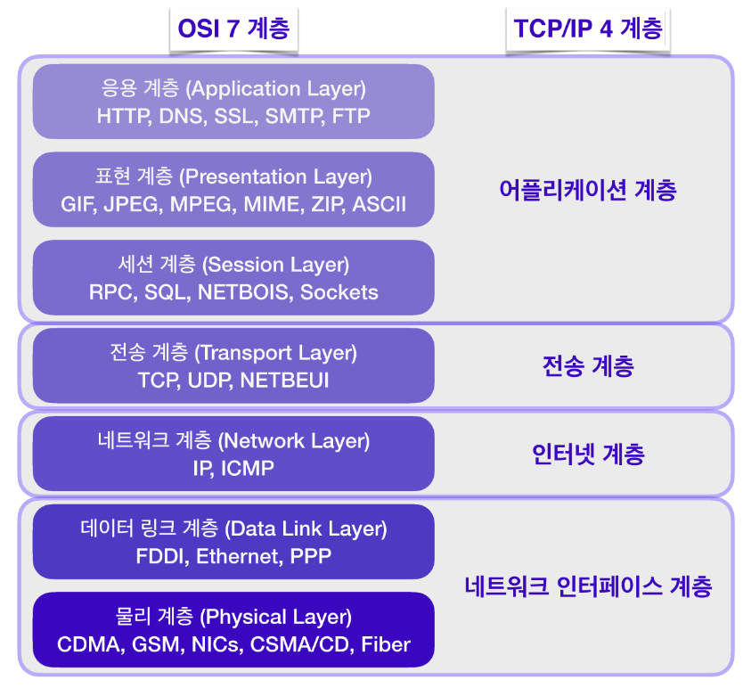

## OSI 7계층 모델
국제표준화기구(ISO)에서 제정한 네트워크 표준 규격. 표준화를 통해 포트, 프로토콜의 호환 문제를 해결하고 문제가 발생했을때 물리적 문제인지 응용 프로그램 문제인지 범위를 좁혀 쉽게 파악할 수 있다.
- 물리 계층 : 시스템 간의 물리적인 연결과 전기 신호를 변환 및 제어하는 계층. 들어온 전기 신호를 그대로 잘 전달하는 것이 목적이다.
- 데이터링크 계층 : 네트워크 기기 간의 데이터 전송 및 물리주소를 결정하는 계층. 주소 정보를 정의하고 출발지,도착지 주소를 확인 후 데이터 처리를 수행한다.
- 네트워크 계층 : 가장 복잡한 계층 중 하나로서 네트워크 간에 데이터 라우팅을 담당한다. 라우팅이란 어떤 네트워크 안에서 통신 데이터를 짜인 알고리즘에 의해 최대한 빠르게 보낼 최적의 경로를 선택하는 과정
- 전송 계층 : 컴퓨터 간 신뢰성 있는 데이터를 서로 주고받을 수 있도록 하는 서비스를 제공하는 계층. 데이터들이 실제로 정상적으로 보내지는지 확인하고 패킷의 순서를 바로 잡아주는 역할도 한다.
- 세션 계층 : 세션 연결의 설정과 해제, 세션 메시지 전송 등의 기능을 수행하는 계층. 양 끝 단의 프로세스가 연결을 성립하도록 도와주고 작업을 마친 후에는 연결을 끊는 역할을 한다.
- 표현 계층 : 응용 계층으로 전달하거나 전달받는 데이터를 인코딩,디코딩 하는 계층. 일종의 번역기 같은 역할
- 응용 계층 : 최종적으로 사용자와의 인터페이스를 제공하는 계층. 사용자가 실행하는 응용 프로그램들이 여기에 속함
### 데이터 송수신
- OSI 7계층 모델은 송신 측의 7계층, 수신 측의 7계층을 통해 데이터를 주고 받는다. 각 계층은 독립적이므로 데이터가 전달되는 동안에 다른 계층의 영향을 받지 않는다.
- 송신 측은 상위 계층에서 하위 계층으로 데이터를 전달한다. 이때 각 계층에서 필요한 정보를 데이터에 추가하는데 이 정보를 헤더라고 하며 이렇게 헤더를 붙여나가는 것을 캡슐화라고 한다.
- 마지막 물리 계층에 도달하면 송신 측의 데이터링크 계층에서 만들어진 데이터가 전기 신호로 변환되어 수신 측에 전송된다.
- 수신 측은 하위 계층에서 상위 계층으로 전달된 데이터를 받게 된다. 이때 각 계층에서 헤더를 제거해 나가는 것을 역캡슐화라고 한다. 역캡슐화를 거쳐 응용 계층에 도달하면 전달하고자 했던 원본 데이터만 남게된다.

## TCP/IP 4계층
OSI모델을 기반으로 실무적으로 이용할 수 있도록 현실에 맞춰 단순화된 모델.
- 네트워크 인터페이스 계층 : 물리적인 주소로 MAC을 사용
- 인터넷 계층 : 통신 노드 간의 IP 패킷을 전송하는 기능 및 라우팅 담당
- 전송 계층 : 통신 노드 간의 연결을 제어하고 신뢰성 있는 데이터 전송을 담당
- 애플리케이션 계층 : TCP/UDP 기반의 응용 프로그램을 구현할 때 사용