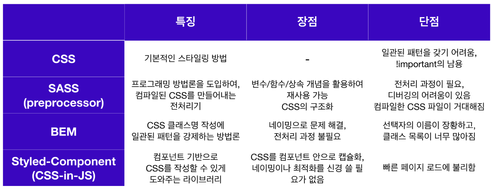

## CDD(Component-Driven Development)
UI 컴포넌트를 재사용 가능한 컴포넌트 단위로 만들어서 협업과 유지보수에 용이하게 하는 컴포넌트 개발 방법

### 구조화 된 CSS
기존의 CSS를 작성할때 일관된 패턴이 없어서 프로젝트가 커지고 복잡해질수록 협업에 어려움이 있었고 CSS작업을 효율적으로 하기 위해 구조화된 CSS가 필요해졌다.
#### CSS 전처리기
- 이러한 문제점들을 해결하기 위해 CSS 전처리기(CSS Preprocessor) 개념이 등장했고 CSS의 문제점을 프로그래밍 개념(변수, 함수, 상속 등)을 활용해 해결할 수 있게했다.
- 하지만 이 CSS 전처리기 자체만으로는 웹서버가 인지하기 못하기 때문에 각 CSS전처리기에 맞는 컴파일러를 사용해야 하고 컴파일을 하게 되면 CSS 문서로 변환된다.
- CSS 전처리기 중에서 가장 유명한 SASS는 CSS를 확장해주는 스크립팅 언어이다. SASS는 SCSS코드를 읽어서 전처리한 다음 컴파일해서 전역 CSS 번들파일을 만들어 주는 전처리기 역할을 한다. 자바스크립트처럼 속성과 값을 변수로 선언하여 반복되는 코드를 여러곳에서 재사용할 수 있도록 하는 등의 기능을 가졌다. 
- 하지만 이 또한 스타일이 겹치는 문제를 해결하기 위해 단순히 계층 구조를 만들어 내는것에 의지하게 되었고 컴파일 된 CSS의 용량이 매우 커졌다.
#### CSS 방법론
- 이러한 CSS 전처리기의 문제를 보완하기 위해 BEM, OOCSS, SMACSS 같은 CSS 방법론이 대두되었다. 방법론의 공통지향점은 `코드의 재사용, 간결화, 확장성, 예측성`이다.
- 대표적인 CSS 방법론은 BEM이 있고 BEM이란 Block, Element, Modifier로 구분하여 클래스명을 작성하는 방법이고 각각은 --와 __로 구분한다. 클래스명은 BEM방식의 이름을 여러번 반복하여 재사용할 수 있도록 하며 HTML/CSS/SASS 파일에서도 더 일관된 코딩 구조를 만들어준다.
- 하지만 방법론들도 문제점이 발생하기 시작한다. 클래스명 선택자가 장황해지고 긴 클래스명 때문에 마크업이 불필요하게 커지며 재사용하려고 할 때마다 모든 UI컴포넌트를 명시적으로 확장해야만 했다.
- 또한 SASS와 BEM도 고치지 못했던 문제들은 로직상에 진정한 캡슐화의 개념이 없다는 것이고 이로 인해 유일한 클래스명을 선택하는 것에 의존할 수밖에 없었다.
### CSS-in-JS의 탄생
- 애플리케이션으로 개발 방향이 진화하면서 컴포넌트 단위의 개발은 캡슐화의 중요성을 불러왔다. 하지만 CSS는 컴포넌트 기반의 방식을 위해 만들어진 적이 한 번도 없었고 CSS도 컴포넌트 영역으로 불러들이기 위해서 CSS-in-JS가 탄생해서 이 문제를 정확하게 해결한다.



#### Styled Components
CSS in JS 라이브러리 중에서 현재 가장 인기 있는 라이브러리이다. CSS in JS 라이브러리를 사용하면 HTML + JS + CSS 까지 묶어서 하나의 JS파일 안에서 컴포넌트 단위로 개발할 수 있게 된다.


### StoryBook
- CDD가 트렌드로 자리 잡게 되면서 이를 지원하는 도구 중 하나인 Component Explorer(컴포넌트 탐색기)가 등장했다. 다양한 UI 개발 도구 중에 하나가 StoryBook이다.
- 각각의 컴포넌트들을 따로 볼 수 있게 구성해 주어 한 번에 하나의 컴포넌트에서 작업할 수 있다.
- StoryBook은 재사용성을 확대하기 위해 컴포넌트를 문서화하고 자동으로 컴포넌트를 시각화하여 시뮬레이션할 수 있는 다양한 테스트 상태를 확인할 수 있다. 이를 통해 버그를 사전에 방지하고 테스트 및 개발 속도를 향상시킨다.
- 기본적으로 독립적인 개발 환경에서 실행된다. 개발자는 어플리케이션의 다양한 상황에 구애받지 않고 UI 컴포넌트를 집중적으로 개발할 수 있다. 회사의 내부 개발자들을 위해 문서화해서 회사의 UI 라이브러리로써 사용하거나 외부 공개용 디자인 시스템을 개발하기 위한 기본 플랫폼으로 사용할 수 있다.


### useRef
리액트는 아래 예외적인 상황에서 useRef로 DOM 노드, 엘리먼트, React컴포넌트 주소값을 참조할 수 있게한다.
- focus, text selection, media playback, 애니메이션 적용, d3.js/greensock 등 DOM기반 라이브러리 활용

제시된 상황을 제외한 대부분의 경우 useRef를 남용하는 것은 부적절하고 React의 특징이자 장점인 선언형 프로그래밍 원칙과 배치되기 때문에 조심해서 사용해야 한다.

```js
const 주소값을_담는_그릇 = useRef(참조자료형)
// 이제 주소값을_담는_그릇 변수에 어떤 주소값이든 담을 수 있다.
return (
    <div>
      <input ref={주소값을_담는_그릇} type="text" />
        {/* React에서 사용 가능한 ref라는 속성에 주소값을_담는_그릇을 값으로 할당하면*/}
        {/* 주소값을_담는_그릇 변수에는 input DOM 엘리먼트의 주소가 담긴다. */}
        {/* 향후 다른 컴포넌트에서 input DOM 엘리먼트를 활용할 수 있다. */}
    </div>);
```
<br>

>[Styled Components 공식 홈페이지](https://styled-components.com/)<br>
[StoryBook 공식 홈페이지](https://storybook.js.org/)