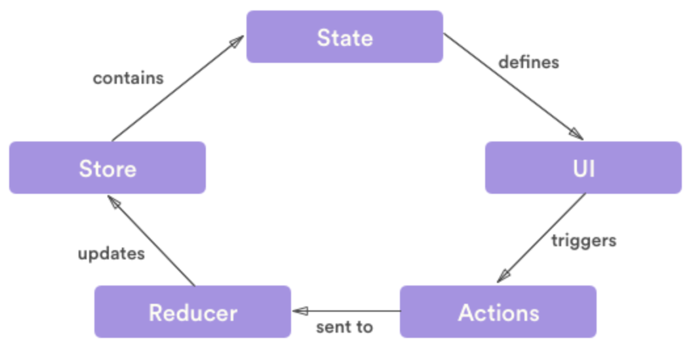

## 프론트엔드에서의 상태관리
- 상태의 범위를 두가지로 분류해보면 특정 컴포넌트 안에서만 관리되고 그 안에서만 영향을 끼치는 로컬 상태와 프로덕트 전체 또는 여러 컴포넌트에서 관리되고 전체적인 영향을 끼치는 전역 상태로 분류할 수 있다.
- 서로 다른 컴포넌트가 사용하는 상태의 종류가 다르면 꼭 전역 상태일 필요없고 출처가 달라도 되지만 서로 다른 컴포넌트가 동일한 상태를 다룬다면 출처는 오직 한 곳이어야 한다.
- 데이터 무결성을 위해 동일한 데이터는 항상 같은 곳에서 가져와야한다. Single source of truth(신뢰할 수 있는 단일 출처)원칙
- 데이터를 보여줘야 하는 프론트엔드에서는 의도한 대로 예외 상황 없이 데이터를 잘 보여줘야 한다.
- 이 상태관리를 도와주는 라이브러리들(React Context, Redux, MobX 등)이 있는데 전역 상태를 위한 저장소를 제공하고 props  drilling을 해결해준다.

### Props Drilling
- 상위 컴포넌트의 state를 props를 통해 전달하고자 하는 하위 컴포넌트로 전달하기 위해 그 사이에 있는 props를 전달하는 용도로만 쓰이는 컴포넌트들을 거치면서 데이터를 전달하는 현상
- props의 전달 횟수가 5회 이내로 많지 않다면 큰 문제가 되지 않지만 프로젝트 규모가 커지고 복잡해지면서 props의 전달 과정이 늘어난다면 여러 문제가 생긴다.
  - 코드 가독성 저하
  - 유지보수 성능 저하
  - state 변경 시 불필요하게 관여된 컴포넌트들도 리렌더링 발생
- 과도한 props drilling을 방지하기 위한 방법으로는 컴포넌트와 관련 있는 state는 되도록 가까이 유지하는 방법과 상태관리 라이브러리를 사용하는 방법이 있다. 상태관리 라이브러리를 사용하게 되면 전역으로 관리하는 저장소에서 직접 state를 꺼내쓸 수 있기 때문에 매우 효과적이다.

## Redux

- Redux는 

