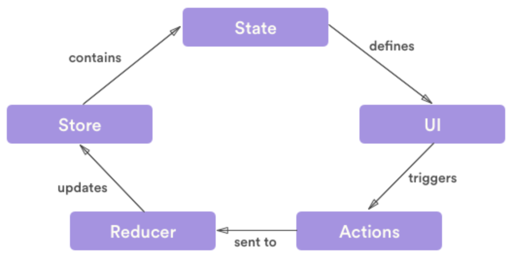

## 프론트엔드에서의 상태관리
- 상태의 범위를 두가지로 분류해보면 특정 컴포넌트 안에서만 관리되고 그 안에서만 영향을 끼치는 로컬 상태와 프로덕트 전체 또는 여러 컴포넌트에서 관리되고 전체적인 영향을 끼치는 전역 상태로 분류할 수 있다.
- 서로 다른 컴포넌트가 사용하는 상태의 종류가 다르면 꼭 전역 상태일 필요없고 출처가 달라도 되지만 서로 다른 컴포넌트가 동일한 상태를 다룬다면 출처는 오직 한 곳이어야 한다.
- 데이터 무결성을 위해 동일한 데이터는 항상 같은 곳에서 가져와야한다. Single source of truth(신뢰할 수 있는 단일 출처)원칙
- 데이터를 보여줘야 하는 프론트엔드에서는 의도한 대로 예외 상황 없이 데이터를 잘 보여줘야 한다.
- 이 상태관리를 도와주는 라이브러리들(React Context, Redux, MobX 등)이 있는데 전역 상태를 위한 저장소를 제공하고 props  drilling을 해결해준다.


### Props Drilling
- 상위 컴포넌트의 state를 props를 통해 전달하고자 하는 하위 컴포넌트로 전달하기 위해 그 사이에 있는 props를 전달하는 용도로만 쓰이는 컴포넌트들을 거치면서 데이터를 전달하는 현상
- props의 전달 횟수가 5회 이내로 많지 않다면 큰 문제가 되지 않지만 프로젝트 규모가 커지고 복잡해지면서 props의 전달 과정이 늘어난다면 여러 문제가 생긴다.
  - 코드 가독성 저하
  - 유지보수 성능 저하
  - state 변경 시 불필요하게 관여된 컴포넌트들도 리렌더링 발생
- 과도한 props drilling을 방지하기 위한 방법으로는 컴포넌트와 관련 있는 state는 되도록 가까이 유지하는 방법과 상태관리 라이브러리를 사용하는 방법이 있다. 상태관리 라이브러리를 사용하게 되면 전역으로 관리하는 저장소에서 직접 state를 꺼내쓸 수 있기 때문에 매우 효과적이다.

## Redux

- 상태 변경 이벤트가 발생하면 변경될 상태에 대한 정보가 담긴 `Action` 객체 생성
- 생성된 Action 객체를 `Dispatch`함수의 인자로 전달
- Dispatch함수는 Action객체를 `Reducer`함수로 전달
- Reducer함수는 Action객체의 값을 확인하고, 그 값에 따라 전역 상태 저장소 `Store`의 상태를 변경
- 상태가 변경되면 리액트는 화면을 다시 렌더링
- Redux에서는 `Action -> Dispatch -> Reducer -> Store`순서로 데이터가 단방향으로 흐름

### Store
- Redux 앱의 state가 저장되는 공간. Store는 상태가 관리되는 오직 하나뿐인 저장소의 역할을 함
```javascript
import { createStore } from 'redux';

const store = createStore(rootReducer);
```
### Reducer
- Reducer는 Dispatch에게서 전달받은 Action객체의 `type`값에 따라서 상태를 변경시키는 함수
- 이때 Reducer는 순수함수여야한다. 외부 요인으로 인해 의도하지 않은 값으로 상태가 변경되는 일이 없어야하기 때문

```javascript
const count = 1

// Reducer를 생성할 때에는 초기 상태를 인자로 요구
const counterReducer = (state = count, action) => {

  switch (action.type) {

    //action === 'INCREASE'일 경우
    case 'INCREASE':
			return state + 1

    // action === 'DECREASE'일 경우
    case 'DECREASE':
			return state - 1

    // action === 'SET_NUMBER'일 경우
    case 'SET_NUMBER':
			return action.payload

    // 해당 되는 경우가 없을 땐 기존 상태를 그대로 리턴
    default:
      return state;
	}
}
```
- 만약 여러개의 Reducer를 사용하는 경우, Redux의 `combineReducers`메서드를 사용해서 하나의 Reducer로 합칠 수 있음
```javascript
import { combineReducers } from 'redux';

const rootReducer = combineReducers({
  counterReducer,
  anyReducer,
  ...
});
```
### Action
- 어떤 동작을 할 것인지 정의해 놓은 객체
- type은 해당 Action 객체가 어떤 동작을 하는지 명시해 주는 역할을 하기 때문에 필수로 지정해줘야하고 대문자와 Snake Case로 작성. 필요에 따라 payload를 작성해 구체적인 값을 전달
- 보통 Action을 직접 작성하기보다는 Action객체를 생성하는 함수를 만들어 사용하는 경우가 많음. 이러한 함수를 액션 생성자(Action Creator)라고도 함.
```javascript
//Action 직접 생성
{ type: 'INCREASE' }
{ type: 'SET_NUMBER', payload: 5 }

//Action Creator 함수 사용
const increase = () => {
  return {
    type: 'INCREASE'
  }
}

const setNumber = (num) => {
  return {
    type: 'SET_NUMBER',
    payload: num
  }
}
```
### Dispatch
- Dispatch는 Reducer로 Action을 전달해주는 함수. 전달인자로 Action 객체를 전달함
- Action 객체를 전달받은 Dispatch함수는 Reducer를 호출함
```javascript
// Action 객체를 직접 작성
dispatch( { type: 'INCREASE' } );
dispatch( { type: 'SET_NUMBER', payload: 5 } );

// 액션 생성자(Action Creator)를 사용
dispatch( increase() );
dispatch( setNumber(5) );
```
## Redux Hooks
Redux Hooks는 React-Redux에서 Redux를 사용할 때 활용할 수 있는 Hooks 메서드를 제공함.
### useDispatch()
Action객체를 Reducer로 전달해 주는 Dispatch 함수를 반환하는 메서드
```javascript
import { useDispatch } from 'react-redux'

const dispatch = useDispatch()
dispatch( increase() )
console.log(counter) // 2

dispatch( setNumber(5) )
console.log(counter) // 5
```
### useSelector()
컴포넌트와 state를 연결하여 Redux의 state에 접근할 수 있게 해주는 메서드
```javascript
import { useSelector } from 'react-redux'
const counter = useSelector(state => state)
console.log(counter) // 1
```

### Redux의 세 가지 원칙
1. Single source of truth
- 동일한 데이터는 항상 같은 곳에서 가지고 와야 한다는 의미. Redux에서는 데이터를 저장하는 `Store`라는 단 하나뿐인 공간이 있음과 연결이 되는 원칙
2. State is read-only
- 상태는 읽기전용 이라는 뜻으로, React에서 상태갱신함수로만 상태를 변경할 수 있었던 것처럼 Redux의 상태도 직접 변경할 수 없음을 의미. `Action`객체가 있어야만 상태를 변경할 수 있음과 연결되는 원칙
3. Changes are made with pure functions
- 변경은 순수함수로만 가능하다는 의미. 상태가 의도치않은 값으로 변경되는 일이 없도록 순수함수로 작성되어야 하는 `Reducer`와 연결되는 원칙

<br>

>[Redux 공식 홈페이지](https://redux.js.org/)<br/>
[robinwieruch 블로그: Redux](https://www.robinwieruch.de/react-redux-tutorial/)<br/>
[FLUX 패턴 공식 문서](https://facebookarchive.github.io/flux/docs/in-depth-overview/)


