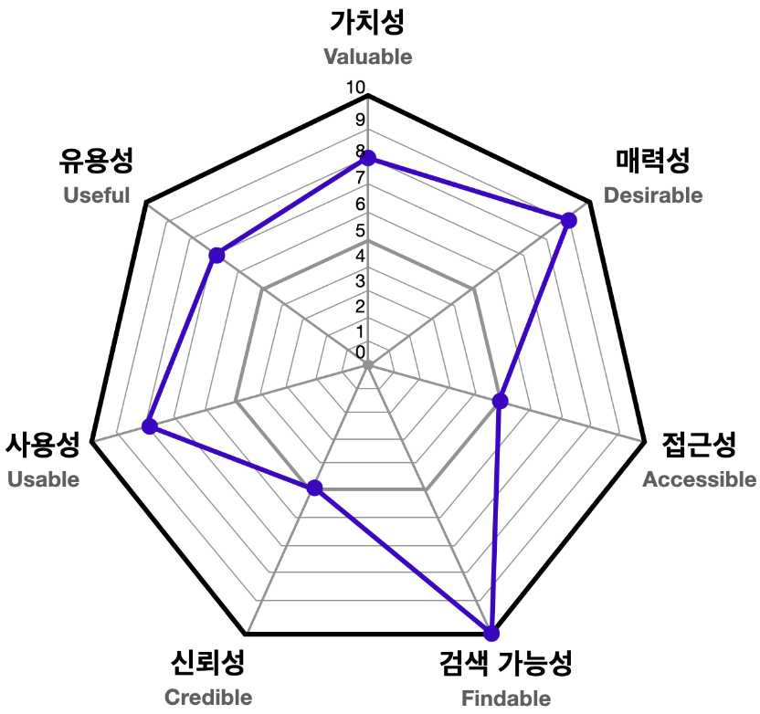

## 피터 모빌의 벌집 모형

피터 모빌의 벌집 모형은 UX를 위해서 고려해야할 7가지 요소를 제시해 줌과 동시에 이미지 처럼 그래프를 활용해 UX를 얼마나 고려했는지 혹은 사용자가 얼마나 좋은 UX를 경험했는지 평가하기 위한 척도로 사용될 수 있다.

1. 유용성(Useful) : 사용 가능한가?
 
제품이나 서비스가 목적에 맞는, 사용 가능한 기능을 제공하고 있는가에 관한 요소이다. 꼭 목적에 맞지 않더라도 비실용적이라도 추가적인 기능을 제공하는지도 관련이 있다.
1. 사용성(Usable) : 사용하기 쉬운가?
 
제품이 본연의 기능을 제공하는 것을 넘어서 사용하기 쉬운가에 관한 요소이다.이 요소는 UI 디자인 패턴과도 연관이 깊다. 자주 쓰이는 패턴들은 사용자들에게도 친숙할 가능성이 높아 사용성을 높여준다.
1. 매력성(Desirable) : 매력적인가?
 
제품이 사용자들에게 매력적인가에 대한 요소이다. 디자인,이미지,브랜등 등 여러 요소들이 사용자에게 긍정적인 감정을 불러일으킬 수 있는지, 사용자들이 해당 제품이나 서비스를 이용하고 싶어 하는지가 중요하다.
1. 신뢰성(Credible) : 신뢰할 수 있는가?
 
사용자가 제품이나 서비스를 믿고 사용할 수 있는가에 관한 요소이다.
1. 접근성(Accessible) : 접근하기 쉬운가?
 
나이,성별,장애 여부를 떠나서 누구든지 제품이나 서비스에 접근할 수 있는가에 관한 요소이다.
1. 검색 가능성(Findable) : 찾기 쉬운가?
 
사용자가 원하는 기능이나 정보를 쉽게 찾을 수 있는가에 관한 요소이다. 네비게이션 바, 정보 검색 기능을 넣거나 콘텐츠를 직관적으로 배치하는 것이 검색 가능성을 높이는 데 도움이 된다.
1. 가치성(Valuable) : 가치를 제공하는가?
 
위에서 언급된 모든 요소들을 총합하여 고객에게 가치를 제공하고 있는가에 관한 요소이다. 가능한 모든 요소를 고르게 고려하는 것이 좋고 제품 사용자들이 공통적으로 중요하게 생각하는 요소를 찾아냈다면 그 요소에 집중하는 것도 UX를 효율적으로 개선하는 전략이 될 수 있다.

## 제이콥 닐슨의 10가지 사용성 평가 기준
1. 시스템 상태의 가시성(Visibility of system status)
 
합리적인 시간 내에 적절한 피드백을 통해 사용자에게 진행 상황에 대한 정보를 항상 제공해야 한다.
 
예시) 첨부를 위한 파일의 업로딩 상황을 표시한다.
1. 시스템과 현실 세계의 일치(Match between system and the real world)
 
내부 전문용어가 아닌 사용자에게 친숙한 단어, 구문 및 개념을 사용한다.
 
예시) 연주 애플리케이션의 모습이 실제 악기의 생김새와 유사하다.
1. 사용자 제어 및 자유(User control and freedom)
 
현재 진행 중인 작업에서 벗어날 수 있는 방법, 혹은 실수로 수행한 작업을 취소할 수 있는 방법, '탈출구'를 명확하게 제공해야 한다.
 
예시) 삭제 직후에 취소할 수 있는 버튼이 잠시 나타난다.
1. 일관성 표준(Consistency and standards)
 
외부 일관성 : 일관적인 사용자 경험을 제공하기 위해서 플랫폼 및 업계의 관습을 따른다.
 
내부 일관성 : 사용자가 혼란스럽지 않도록 제품이 인터페이스나 정보 제공에 일관성이 있어햐 한다.
 
예시) 버튼의 모양,위치,아이콘 크기 등
1. 오류 방지(Error prevention)
 
오류가 발생하기 쉬운 상황을 제거하여 사용자의 실수를 방지해야 한다.
 
예시) 삭제 버튼을 눌렀을 때 정말로 삭제할 것인지를 이용자의 의사를 확인하기 위해 다시 물어본다.
1. 기억보다는 직관(Recognition rather than recall)
 
사용자가 기억해야 하는 정보를 줄인다.
 
예시) 최근 검색했던 단어 목록을 확인할 수 있다.
1. 사용의 유연성광 효율성(Flexibility and efficiency of use)
 
초보자와 전문가 모두에게 개별 맞춤 기능을 제공하도록 한다.
 
예시) 프로그램의 단축키를 직접 설정하여 사용할 수 있다.
1. 미학적이고 미니멀한 디자인(Aesthetic and minimalist design)
 
인터페이스에는 관련이 없거나 불필요한 정보가 포함되지 않도록 한다. 콘텐츠와 기능의 우선순위를 정하고 우선순위가 높은 것을 잘 제공하고 있는지 확인한다.
 
예시) 사용 빈도가 적은 메뉴를 다 보여줄 필요는 없다. 필요할 때에만 볼 수 있게 숨겨놓는 것도 좋은 방법이다.
1. 오류의 인식, 진단, 복구를 지원(Help users recognize, diagnose, and recover from errors)
 
사용자가 이해할 수 있는 언어를 사용하여 문제가 무엇인지 정확하게 표시하고 해결 방법을 제안해야 한다.
 
예시) 영문을 입력해야 하는 폼에서는 한글이 아닌 영어를 입력해야 함을 정확하게 알려준다.
1. 도움말 및 설명 문서(Help and documentation)
 
추가 설명이 필요 없는 것이 가장 좋지만 상황에 따라 이해하는 데 도움이 되는 문서를 제공해야 한다.
 
예시) 간단한 안내를 통해 검색에 도움을 준다.